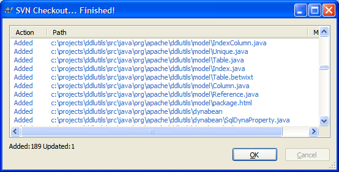

.. Licensed to the Apache Software Foundation (ASF) under one
   or more contributor license agreements.  See the NOTICE file
   distributed with this work for additional information
   regarding copyright ownership.  The ASF licenses this file
   to you under the Apache License, Version 2.0 (the
   "License"); you may not use this file except in compliance
   with the License.  You may obtain a copy of the License at

    http://www.apache.org/licenses/LICENSE-2.0

   Unless required by applicable law or agreed to in writing,
   software distributed under the License is distributed on an
   "AS IS" BASIS, WITHOUT WARRANTIES OR CONDITIONS OF ANY
   KIND, either express or implied.  See the License for the
   specific language governing permissions and limitations
   under the License.

.. _`Apache Subversion`: http://subversion.apache.org
.. _`TortoiseSVN`: http://tortoisesvn.tigris.org

Downloading DdlUtils
====================

Binary distribution
-------------------

These are the currently released versions:

`DdlUtils 1.0 <http://www.apache.org/dyn/closer.cgi/db/ddlutils/ddlutils-1.0/>`_

* `Binary ZIP file <http://www.apache.org/dyn/closer.cgi/db/ddlutils/ddlutils-1.0/binaries/DdlUtils-1.0-bin.zip>`_
  (`Signature <http://www.apache.org/dist/db/ddlutils/ddlutils-1.0/binaries/DdlUtils-1.0-bin.zip.asc>`_, `MD5 <http://www.apache.org/dist/db/ddlutils/ddlutils-1.0/binaries/DdlUtils-1.0-bin.zip.md5>`_, `SHA1 <http://www.apache.org/dist/db/ddlutils/ddlutils-1.0/binaries/DdlUtils-1.0-bin.zip.sha>`_)
* `JAR file <http://www.apache.org/dyn/closer.cgi/db/ddlutils/ddlutils-1.0/binaries/DdlUtils-1.0.jar>`_
  (`Signature <http://www.apache.org/dist/db/ddlutils/ddlutils-1.0/binaries/DdlUtils-1.0.jar.asc>`_, `MD5 <http://www.apache.org/dist/db/ddlutils/ddlutils-1.0/binaries/DdlUtils-1.0.jar.md5>`_, `SHA1 <http://www.apache.org/dist/db/ddlutils/ddlutils-1.0/binaries/DdlUtils-1.0.jar.sha>`_)
* `Source ZIP file <http://www.apache.org/dyn/closer.cgi/db/ddlutils/ddlutils-1.0/source/DdlUtils-1.0-src.zip>`_
  (`Signature <http://www.apache.org/dist/db/ddlutils/ddlutils-1.0/source/DdlUtils-1.0-src.zip.asc>`_, `MD5 <http://www.apache.org/dist/db/ddlutils/ddlutils-1.0/source/DdlUtils-1.0-src.zip.md5>`_, `SHA1 <http://www.apache.org/dist/db/ddlutils/ddlutils-1.0/source/DdlUtils-1.0-src.zip.sha>`_)
* `Documentation ZIP <http://www.apache.org/dyn/closer.cgi/db/ddlutils/ddlutils-1.0/doc/DdlUtils-1.0-doc.zip>`_
  (`Signature <http://www.apache.org/dist/db/ddlutils/ddlutils-1.0/doc/DdlUtils-1.0-doc.zip.asc>`_, `MD5 <http://www.apache.org/dist/db/ddlutils/ddlutils-1.0/doc/DdlUtils-1.0-doc.zip.md5>`_, `SHA1 <http://www.apache.org/dist/db/ddlutils/ddlutils-1.0/doc/DdlUtils-1.0-doc.zip.sha>`_)

You can find the KEYS file containing the public keys for verifying the signature
`here <http://www.apache.org/dist/db/ddlutils/KEYS>`_.

Source code
-----------

DdlUtils uses `Apache Subversion`_ as its source repository. To access it
you need a SVN client. 

The ``svn`` command is usually readily available in these systems. Here all
you need to do is to change to a directory where you want to put DdlUtils into, and
then issue this command:

	svn co http://svn.apache.org/repos/asf/db/ddlutils/trunk ddlutils

This will checkout the current development version of DdlUtils in read-only mode.
This means you can play around with the source without fear for breaking anything
as the changes cannot be checked back in. 

.. note::
	 If you're a committer, you'll have to replace the ``http`` with ``https``.

For Windows systems, one of the available SVN clients is
`TortoiseSVN`_ which is a Windows Explorer extension.
After you've installed it and rebooted you computer (which is necessary
because of it nature as an Explorer extension), you'll have additional
options in the context menu in Explorer. Change to a directory where you
want to checkout DdlUtils, and choose the "SVN Checkout ..." option
from the context menu. You'll get this dialog:

.. image:: images/tortoisesvn-checkout-dlg.png
   :alt: TortoiseSVN checkout dialog

After you clicked OK, TortoiseSVN will checkout to the designated place. Once it
has finished you can start using DdlUtils:

